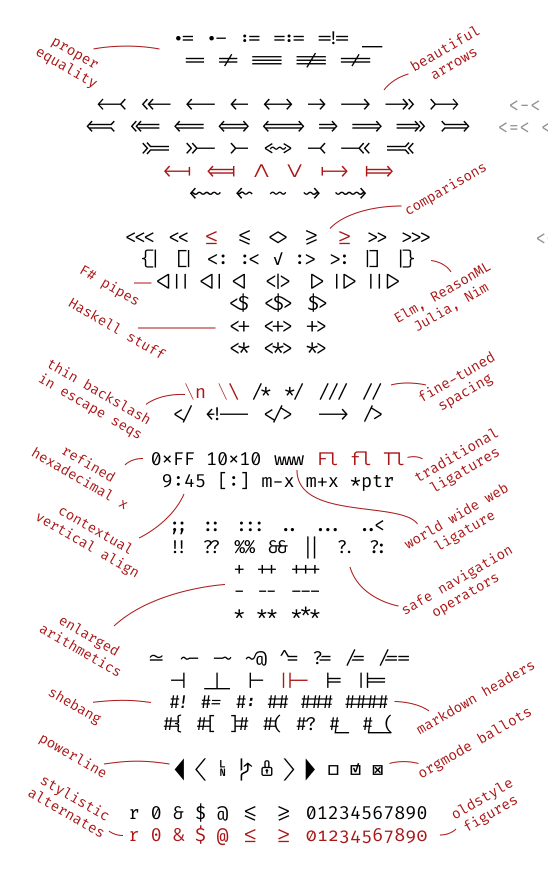

class:inverse, center

```{r setup, include = FALSE}
knitr::opts_chunk$set(warning = FALSE, message = FALSE)
library(tidyverse)
theme_set(theme_bw())
```


# RStudio Conference 2020

### January 27-30 San Francisco, CA

---

#Conference takeaways 

--
### - 2200+ attendees

--
### - Very welcoming community

--
### - Didn't feel like a n00b! 


---
background-image: url(usethis_hex.png)
background-position: 90% 10%

#2-day workshop 
## My first R package 

<br>

.medium[**Takeaway**: Packages are MUCH easier to make than you might think]

--

Start with a data package for your research

---

#Keynote 1: Rstudio is now a B Corporation 

--

- .medium[Open source software ("Free" - no cost but ALSO no restrictions)]

--

- .medium[How to fund open source for resiliency and longevity?]

--

- .medium["Virtuous cycle" - balance between commercial ("Enterprise Products") and open source tools.] 

--

- .medium[BUT! Corporations are inherently not trustworthy...]

--

- Not planning on selling the company 


---
background-image: url(reprex_hex.png)
background-position: 90% 10%

# Keynote 3: Jenny Bryan
### Debugging code 

.medium[1. Restart your R session! 
     - Don't save your R history/data
     
2. Use the debugging functions

3. Make a reprex]

---
background-image: url(reprex_hex.png)
background-position: 90% 10%

.large[Reprex = **Rep**roducible **ex**ample]

<br>

.medium[Use small, simple, built-in, data] 

(ex: ggplot2::mtcars or dplyr::starwars)

--

<br>

.medium[Making a reprex is both an art and a science]

--

`library(reprex)`


---

#Flipbookr

`devtools::install_github("EvaMaeRey/flipbookr")`

```{r, cache = FALSE, include = FALSE}
devtools::install_github("vanichols/rgronomists")
library(flipbookr)
library(tidyverse)
library(lubridate)
library(rgronomists)

wea_ames_30yrs <- as_tibble(wea_ames_30yrs)
wea_sum <- wea_ames_30yrs %>%
  select(station_name, 
         day, 
         precip) %>% 
  mutate(year_id = year(day)) %>% 
  group_by(year_id) %>% 
  summarise(totp = sum(precip))
```

---

`r chunk_reveal("sumex", break_type = "auto")`

```{r sumex, include = FALSE, echo = FALSE}
wea_ames_30yrs %>%
  select(station_name, 
         day,
         precip) %>% 
  mutate(year_id = year(day)) %>% 
  group_by(year_id) %>% 
  summarise(totp = sum(precip))
```


---

`r chunk_reveal("wea", break_type = "auto")`

```{r wea, include = FALSE, echo = FALSE}
 wea_sum %>% 
  ggplot() +
  aes(x = year_id) +
  aes(y = totp) + 
  geom_point(
    color = "blue" 
    ) +
  geom_col(
    fill = "red" 
    )
```


---
class:center

# New font you didn't know you needed: Fira code


`<-`    `<<-`    `==`    `<=`    `>=`    `!=`

vs. 

.small[<-  <<-   ==   <=   >=   !=]


###[Very easy to download](https://github.com/tonsky/FiraCode)

---
class:center



---

#Styling Shiny Apps 
### with Sass and Bootstrap 4


---

##ggtext package

`devtools::install_github("wilkelab/ggtext")`   

--

.medium[- Allows one to use "rich text" in ggplot]

--

.medium[- NB: must download *development* version of ggplot2]

`devtools::install_github("tidyverse/ggplot2")`   

---

##ggtext package

```{r}
library(glue)

iris_subset <- iris %>%
  group_by(Species) %>%
  summarize(avg_Sepal_Length = mean(Sepal.Length)) %>%
  mutate(Species = glue("*Iris {Species}*"),
         Color = c("#66C2A5", "#FC8D63", "#8DA0CB")) 

iris_subset
```

---
##ggtext package
.tinyer[
```{r, fig.height=4}
library(ggtext)

iris_subset %>%
  ggplot(aes(Species, avg_Sepal_Length))+
  geom_col(aes(fill = Color))+
  scale_fill_identity()+
  labs(x = NULL,
       y = "Average Sepal Length")+
  theme(axis.text.x = element_markdown(size = 14))
```
]
---
##ggtext package

.tinyer[
```{r, fig.height=4}
library(glue)
library(ggtext)

iris_subset %>%
  mutate(color_id = glue("<B<i style = 'color:{Color}'>{Species}</i></B>")) %>%
  ggplot(aes(color_id, avg_Sepal_Length))+
  geom_col(aes(fill = Color))+
  scale_fill_identity()+
  labs(x = NULL,
       y = "Average Sepal Length")+
  theme(axis.text.x = element_markdown(size = 14))
```
]
---

# Cite the tidyverse!

```{r, results = 'asis'}
citation("tidyverse")
```

---

Other, misc things? 

- .medium[Pins package]
- .medium[renv package] creates a mini-library for each project so you can keep version 0.2.0 of vctrs]
- .medium[*instant eyedropper* browser extension] lets you steal colors from webpages

---